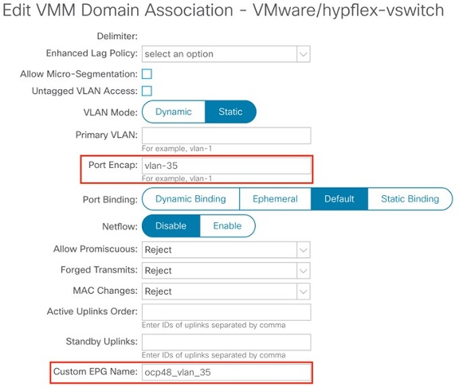
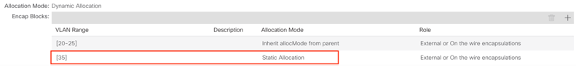
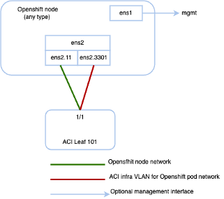

# Installing Agent Based OpenShift 4.15 on VMware vSphere

## Table of contents

* [Agent Based OpenShift 4.15 on VMware vSphere](#agent-based-openshift-4.15-on-vmware-vsphere)

* [Prerequisites for Installing Agent Based OpenShift 4.15 on VMware vSphere](#prerequisites-for-installing-agent-based-openshift-4.15-on-vmware-vsphere)

* [Installing Agent Based OpenShift 4.15 on VMware vSphere](#installing-agent-based-openshift-4.15-on-vmware-vsphere)

* [Configuring ACI Infra and CNI](#configuring-aci-infra-and-cni)

* [Preparing Custom Network Configuration for OpenShift Nodes](#preparing-custom-network-configuration-for-openshift-nodes)

* [What to do next](#what-to-do-next)

* [Sample Files](#sample-files)

* [Post Install Configuration and Scaling](#post-install-configuration-and-scaling)

* [Decommissioning OpenShift](#decommissioning-openshift)

* [Known Caveats](#known-caveats)


## Agent Based OpenShift 4.15 on VMware vSphere

Cisco ACI supports Agent Based Red Hat OpenShift 4.15 on VMware vSphere. This document provides the instructions to provision OpenShift 4.15
on VMware vSphere with the Container Network Interface (CNI) plug-in.


## Prerequisites for Installing Agent Based OpenShift 4.15 on VMware vSphere

To install Agent Based OpenShift Container Platform (OCP) 4.15 on VMware vSphere, fulfill the following prerequisites:

### Cisco ACI

* Download the acc-provision tool version `6.0.4.1` or later.
* Specify the `--flavor` option value as `openshift-4.14-agent-based-esx` and use the `-z` option. 
* The tool creates a `.tar` archive file as specified by the `-z` option value. You need this archive file during installation. Make sure that the Cisco ACI container images that are specified as input to the acc-provision tool are version `6.0.4.1` or later.

### VMware vSphere
Obtain user credentials with privileges to create virtual machines (VMs).
### OpenShift
Obtain the following from the Red Hat website:
* `OCP4 client tools` - navigate to the mirror page on the OpenShift website where the installation and client tool versions are listed, and select the required version. 
* Download the `openshift-client-linux.tar.gz` and `openshift-install-linux.tar.gz` files.
* Pull Secret


## Installing Agent Based OpenShift 4.15 on VMware vSphere

### Before you begin

Complete the tasks in the previous section: Prerequisites for Installing Agent Based OpenShift 4.15 on VMware vSphere .
It is recommended to see the RedHat OpenShift documentation for prerequisites and other details about Installing a Cluster on vSphere


## Configuring ACI Infra and CNI

Use this procedure for configuring ACI infra and CNI using
acc-provision.

### Procedure
Procedure

**Step 1.**	
* Provision the Cisco ACI fabric using the acc-provision utility:
* Customize the sample acc-provision input file as per your requirements. Then, install the latest acc-provision package from https://pypi.org/project/acc-provision/ and run pip install acc-provision .
* Run the acc-provision as follows:
```
$ ~/openupi$ pwd
/home/<user>/openupi
$ ~/openupi$ acc-provision -a -c acc_provision_input.yaml  -f openshift-4.14-agent-based-esx -u <user> -p <password> -o aci_deployment.yaml -z aci deployment.yaml.tar.gz
```

This generates a new aci_deployment.yaml.tar.gz file which contains the ACI CNI manifests, and is used later during the OpenShift installation.

**Note** See acc-provision-input file in [Sample Files](#sample-files) section.

**Note** acc-provision tool is supported to run on RHEL8 and RHEL9 operating system.

**Step 2.**	
* After the Cisco ACI fabric is provisioned, verify that a port group with the name system_id_vlan_kubeapi_vlan is created under distributed switch.
* This document refers to this port group as api-vlan-portgroup.

**Note**	api-vlan-progroup port-group in VMware Distributed Virtual Switch is created using custom VLAN ID provided in the acc_provision_input file as kubeapi_vlan.



<p align="center"><strong>Figure 1: VMM VMware domain association with aci-containers-nodeEPG</strong></p>
Kube_api VLAN is added to the dynamic VLAN pool associated with the Vmware VMM Domain. Allocation mode will be set to Static



<p align="center"><strong>Figure 2: VLAN Pool used for VMM Vmware domain</strong></p>


## Preparing Custom Network Configuration for OpenShift Nodes

ACI CNI requires additional VLANs to be extended towards each OpenShift
node. Additional VLANS are required for master and worker nodes, but not
required for the bootstrap node.

You can configure additional VLANs on the interface that will be
configured with the node network subnet, or can be configured on an
additional physical interface on the hosts.

The available option to configure network interface of a host is to
provide the configuration in agent-config.yaml in NMState format. See
Sample agent-config File Section


### Agent-Config File Modification

**Before you begin**

The agent-config file, with additional NIC configuration, required to
extend the Cisco ACI internal network (Infra VLAN) up to the server
level. This interface is used to carry VxLAN traffic from OVS towards
the ACI leaf switch with an appropriate tag for the pod network. The
configuration offers below option for node and pod network
configuration:

-   Single Sub interface for both node and infra networks.

The option illustrated as shown below:

<p align="center">
  
</p>

**Note** Node network is configured as VLAN subinterface of either bond0 or Virtual machine NIC. You can configure the server with additional VLAN(s) for management purpose or use the node network for management network. The design might be dependent on the server provisioning method (PXE or manual ISO boot).

```
apiVersion: v1alpha1
kind: AgentConfig
metadata:
  name: ocpvmw11
rendezvousIP: 192.168.12.3 -> A
AdditionalNTPSources:
  - time.cisco.com
hosts: -> B
  - hostname: ocpvmw11-master1 -> C
    role: master
    interfaces:
    - name: ens192
      macAddress: 00:50:56:97:2a:d6
    networkConfig: -> D
      interfaces:
        - name: ens192
          mtu: 9000
          ipv4:
            enabled: false
          ipv6:
            enabled: false
        - name: node
          type: vlan
          mtu: 9000
          state: up
          vlan:
            base-iface: ens192
            id: 131
          ipv4:
            enabled: true
            address:
              - ip: 192.168.12.3
                prefix-length: 24
            dhcp: false
          ipv6:
            enabled: false
        - name: infra
          type: vlan
          mtu: 9000
          state: up
          vlan:
            base-iface: ens192
            id: 3301
          ipv4:
            enabled: true
            dhcp: true
          ipv6:
            enabled: false
      dns-resolver:
        config:
          server:
            - 192.168.12.2
      routes:
        config:
          - destination: 0.0.0.0/0
            next-hop-address: 192.168.12.1
            next-hop-interface: node
          - destination: 224.0.0.0/4
            next-hop-interface: infra  
```

**A**.  This IP address is used to determine which node performs the
    bootstrapping process as well as running
    the assisted-service component. You must provide the rendezvous IP
    address when you do not specify at least one host's IP address in
    the networkConfig parameter. If this address is not provided, one IP
    address is selected from the provided hosts' networkConfig

**B**.  Host configuration. The number of hosts defined must not exceed the
    total number of hosts defined in the install-config.yaml file, which
    is the sum of the values of
    the compute.replicas and controlPlane.replicas parameters

**C**.  Overrides the hostname obtained from either the Dynamic Host
    Configuration Protocol (DHCP) or a reverse DNS lookup. Each host
    must have a unique hostname supplied by one of these methods

**D**.  Configures the network interface of a host in NMState format.

##### Procedure

**Step 1**	Create a root folder for your cluster.

```cd /home/<user>/openupi mkdir upi```

**Step 2**	Copy the install-config.yaml, agent-config.yaml in the newly created upi folder. 
Refer install-config and agent-config in [Sample Files](#sample-files) Section

**Step 3**	Create the openshift directory
```
mkdir -p /home/<user>/openupi/upi/opensfhit
```
**Step 4**	Extract all the ACI manifest files in upi/openshift/.

```tar -xvf aci_deployment.yaml.tar.gz -C upi/openshift/```
**Step 5**	Create the iso image.

```openshift-install agent create image –dir=upi –log-level debug```


**Step 6**	Boot the `agent.x86_64.iso` image on the virtual machines

The `agent.x86_64.iso` is now ready and can be uploaded to associated datastore or manually copied to the host volumes so they can be served to your nodes. The `agent.x86_64.iso`  file will be consumed by every node and the network configuration for each node will be recognized based on the mac-address mention in NMState configuration for each node.

**Step 7**	Create the VMs – Refer Sample agent-config file for naming reference. 
* Provide name of the host (master/worker) as mentioned in agent-config.yaml hostname field

* Select system_id_vlan_kubeapi_vlan as the network. Edit the mac address to match with the mac address mentioned for the VM in the agent-config.yaml.

* Enable disk UUID – Click VM Options tab,  and select Advanced. Click Edit Configuration in Configuration Parameters. Click Add parameter. In the Key column, type disk.EnableUUID. In the Value column, type TRUE. Click OK and click Save.

* Select the uploaded image agent.x86_64.iso   in the associated datastore


## What to do next

You can use the commands `openshift-install agent wait-for
bootstrap-complete` and `openshift-install agent wait-for install-complete`
to check the progress of the installation. Execute the commands from the
bootstrap directory.


## Sample Files

This section contains sample files that you need for installing agent based OpenShift 4.15 on Vmware vSphere.

**Sample acc-provision-input File**

The following is a sample acc-provision-input.yaml. The highlighted or
bold values are those that you must modify to meet your site
requirements.

```
aci_config:
  system_id: ocp4aci
  #apic-refreshtime: 1200
  apic_hosts:
  - 1.1.1.1
  vmm_domain:
    encap_type: vxlan
    mcast_range:
      start: 225.28.1.1
      end: 225.28.255.255
    nested_inside:
      type: vmware 
      name: my-vswitch
      elag_name: <eLAG_name>
 
  # The following resources must already exist on the APIC.
  # They are used, but not created, by the provisioning tool.
  Aep: my-aep
  vrf:                          # This VRF used to create all kubernetes Eps
    name: myl3out_vrf
    tenant: common
  l3out:
    name: myl3out
    external_networks:
    - myl3out_net
agent_based_installer:
  enable: true
#
# Networks used by ACI containers
#
net_config:
  node_subnet: 192.168.18.1/24
  pod_subnet: 10.128.0.1/16
  extern_dynamic: 10.3.0.1/24
  extern_static: 10.4.0.1/24
  node_svc_subnet: 10.5.0.1/24  # Subnet to use for service graph
  kubeapi_vlan: 131
  service_vlan: 132
  infra_vlan: 3301
#interface_mtu: 1600
#service_monitor_interval: 5  # IPSLA interval probe time for PBR tracking
                              # default is 0, set to > 0 to enable, max: 65535
#pbr_tracking_non_snat: true  # Default is false, set to true for IPSLA to
# Subnet to use for Kubernetes
#   Pods/CloudFoundry containers
# Subnet to use for dynamic external IPs
# Subnet to use for static external IPs
# be effective with non-snat services
 
# Configuration for container registry
# Update if a custom container registry has been setup
#
kube-config:
  image_pull_policy: Always
  ovs_memory_limit: 1Gi
registry:
  image_prefix: quay.io/noiro
```


**Sample agent-config File**

```
apiVersion: v1alpha1
kind: AgentConfig
metadata:
  name: ocpvmw11
rendezvousIP: 192.168.12.3
AdditionalNTPSources:
  - time.cisco.com
hosts:
  - hostname: ocpvmw11-master1
    role: master
    interfaces:
    - name: ens192
      macAddress: 00:50:56:97:2a:d6
    networkConfig:
      interfaces:
        - name: ens192
          mtu: 9000
          ipv4:
            enabled: false
          ipv6:
            enabled: false
        - name: node
          type: vlan
          mtu: 9000
          state: up
          vlan:
            base-iface: ens192
            id: 131
          ipv4:
            enabled: true
            address:
              - ip: 192.168.12.3
                prefix-length: 24
            dhcp: false
          ipv6:
            enabled: false
        - name: infra
          type: vlan
          mtu: 9000
          state: up
          vlan:
            base-iface: ens192
            id: 3301
          ipv4:
            enabled: true
            dhcp: true
          ipv6:
            enabled: false
      dns-resolver:
        config:
          server:
            - 192.168.12.2
      routes:
        config:
          - destination: 0.0.0.0/0
            next-hop-address: 192.168.12.1
            next-hop-interface: node
          - destination: 224.0.0.0/4
            next-hop-interface: infra
  - hostname: ocpvmw11-master2
    role: master
    interfaces:
    - name: ens192
      macAddress: 00:50:56:97:f6:65
    networkConfig:
      interfaces:
        - name: ens192
          mtu: 9000
          ipv4:
            enabled: false
          ipv6:
            enabled: false
        - name: node
          type: vlan
          mtu: 9000
          state: up
          vlan:
            base-iface: ens192
            id: 131
          ipv4:
            enabled: true
            address:
              - ip: 192.168.12.4
                prefix-length: 24
            dhcp: false
          ipv6:
            enabled: false
        - name: infra
          type: vlan
          mtu: 9000
          state: up
          vlan:
            base-iface: ens192
            id: 3301
          ipv4:
            enabled: true
            dhcp: true
          ipv6:
            enabled: false
      dns-resolver:
        config:
          server:
            - 192.168.12.2
      routes:
        config:
          - destination: 0.0.0.0/0
            next-hop-address: 192.168.12.1
            next-hop-interface: node
          - destination: 224.0.0.0/4
            next-hop-interface: infra
  - hostname: ocpvmw11-master3
    role: master
    interfaces:
    - name: ens192
      macAddress: 00:50:56:97:07:42
    networkConfig:
      interfaces:
        - name: ens192
          mtu: 9000
          ipv4:
            enabled: false
          ipv6:
            enabled: false
        - name: node
          type: vlan
          mtu: 9000
          state: up
          vlan:
            base-iface: ens192
            id: 131
          ipv4:
            enabled: true
            address:
              - ip: 192.168.12.5
                prefix-length: 24
            dhcp: false
          ipv6:
            enabled: false
        - name: infra
          type: vlan
          mtu: 9000
          state: up
          vlan:
            base-iface: ens192
            id: 3301
          ipv4:
            enabled: true
            dhcp: true
          ipv6:
            enabled: false
      dns-resolver:
        config:
          server:
            - 192.168.12.2
      routes:
        config:
          - destination: 0.0.0.0/0
            next-hop-address: 192.168.12.1
            next-hop-interface: node
          - destination: 224.0.0.0/4
            next-hop-interface: infra
  - hostname: ocpvmw11-worker1
    role: worker
    interfaces:
    - name: ens192
      macAddress: 00:50:56:97:b5:07
    networkConfig:
      interfaces:
        - name: ens192
          mtu: 9000
          ipv4:
            enabled: false
          ipv6:
            enabled: false
        - name: node
          type: vlan
          mtu: 9000
          state: up
          vlan:
            base-iface: ens192
            id: 131
          ipv4:
            enabled: true
            address:
              - ip: 192.168.12.6
                prefix-length: 24
            dhcp: false
          ipv6:
            enabled: false
        - name: infra
          type: vlan
          mtu: 9000
          state: up
          vlan:
            base-iface: ens192
            id: 3301
          ipv4:
            enabled: true
            dhcp: true
          ipv6:
            enabled: false
      dns-resolver:
        config:
          server:
            - 192.168.12.2
      routes:
        config:
          - destination: 0.0.0.0/0
            next-hop-address: 192.168.12.1
            next-hop-interface: node
          - destination: 224.0.0.0/4
            next-hop-interface: infra
  - hostname: ocpvmw11-worker2
    role: worker
    interfaces:
    - name: ens192
      macAddress: 00:50:56:97:44:9b
    networkConfig:
      interfaces:
        - name: ens192
          mtu: 9000
          ipv4:
            enabled: false
          ipv6:
            enabled: false
        - name: node
          type: vlan
          mtu: 9000
          state: up
          vlan:
            base-iface: ens192
            id: 131
          ipv4:
            enabled: true
            address:
              - ip: 192.168.12.7
                prefix-length: 24
            dhcp: false
          ipv6:
            enabled: false
        - name: infra
          type: vlan
          mtu: 9000
          state: up
          vlan:
            base-iface: ens192
            id: 3301
          ipv4:
            enabled: true
            dhcp: true
          ipv6:
            enabled: false
      dns-resolver:
        config:
          server:
            - 192.168.12.2
      routes:
        config:
          - destination: 0.0.0.0/0
            next-hop-address: 192.168.12.1
            next-hop-interface: node
          - destination: 224.0.0.0/4
            next-hop-interface: infra
```

**Sample install-config File**

```
apiVersion: v1
baseDomain: ocplab.local
proxy:
  httpsProxy: <http-proxy> 
  httpProxy: <https-proxy> 
  noProxy: <no-proxy>
compute:
- name: worker
  replicas: 2
controlPlane:
  name: master
  replicas: 3
metadata:
  name: ocpvmw11
networking:
  machineNetwork:
  - cidr: 192.168.12.0/24
  clusterNetwork:
  - cidr: 10.2.0.0/16
    hostPrefix: 23
  networkType: CiscoACI
  serviceNetwork:
  - 172.30.0.0/16
platform:
  vsphere:
    failureDomains:
    - topology:
        datacenter: k8s-scale
        datastore: "/k8s-scale/datastore/k8s-scale-ds-esxi-3-raid5"
    vcenters:
    - datacenters:
      - k8s-scale
      password: xxx
      port: 443
      server: myvsphere.local.lab
      user: administrator@vsphere.local
    apiVIPs:
    - 192.168.12.30
    ingressVIPs:
    - 192.168.12.29
fips: false
pullSecret: <RH-account-pull-secret> 
sshKey: <host-ssh-key>
```

## Post Install Configuration and Scaling
* As per https://docs.openshift.com/container-platform/4.15/post_installation_configuration/installing-vsphere-post-installation-configuration.html for installations using the Assisted Installer, you must update the connection settings. This is because the Assisted Installer adds default connection settings to the vSphere connection configuration wizard as placeholders during the installation
* Follow steps provided in the link: https://access.redhat.com/solutions/6677901 to modify the platform configuration which will provide cluster access to the vcenter.
* After successful completion of above step, cluster is ready to be scaled via machineset.
* Follow steps to create machineset as mentioned in the link: https://docs.openshift.com/container-platform/4.15/machine_management/creating_machinesets/creating-machineset-vsphere.html to scale the cluster.

## Decommissioning OpenShift

Use this procedure to decommission OpenShift and remove the
ACI-provisioned configuration from ACI.

**Note** Starting with Cisco APIC release 6.1, VMM domains for OpenShift cannot be removed from the APIC GUI. It is only possible using REST API, therefore, it is convenient to use the acc-provision tool to remove the VMM domain, and other related objects used by the decommissioned OpenShift cluster. Ensure you have the acc-input-config.yaml file and certificates used by the acc-provision tool to access APIC

### Before you begin

In case of decommissioning or removing Openshift cluster, ACI
configuration provisioned for that cluster should be removed from ACI.
The acc-provision tool can be used to remove that configuration.

### Procedure

Use the following command from the machine and folder which was used to provision the ACI infrastructure, to delete the pre-provisioned configurations and the VMM domain.

```acc-provision -d -f openshift-4.14-agent-based-esx -c acc-input-file -u user -p password```

Example:
`acc-provision -d -f openshift-4.14-agent-based-esx -c acc-input-config.yaml -u admin -p password`


## Known Caveats

* Installation hinders due to node Taints -
    https://access.redhat.com/support/cases/#/case/03682671

* Storage Cluster Operator Degraded -- Solution in progress -
    https://access.redhat.com/solutions/5926951
