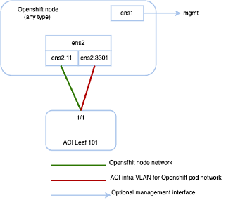

# Installing Agent Based OpenShift 4.16 on a Bare Metal Server

## Table of contents

* [Agent-Based OpenShift 4.16 on Bare Metal](#agent-based-openshift-4.16-on-bare-metal)
* [Requirements for supporting Agent Based OpenShift 4.16 on a Bare Metal Server](#requirements-for-supporting-agent-based-openshift-4.16-on-a-bare-metal-server)
* [Installation Process](#installation-process)
* [Scaling Agent-Based Installation with the Bare Metal Operator](#scaling-agent-based-installation-with-the-bare-metal-operator)


## Agent-Based OpenShift 4.16 on Bare Metal

This document pertains to installing OCP with the ACI CNI. However, to
identify and resolve issues in your infrastructure not related to the
ACI CNI, see the relevant installation guide to first install OCP on
your bare metal nodes using the default OVN Kubernetes. *You can check
the OpenShift 4.16 container platform documentation.*

**Note** This document can not be used standalone. This document
should be used along with the *Red Hat OpenShift 4.16 Installing an
on-premise cluster with the Agent-based Installer* document to perform
the OpenShift cluster installation.

## Requirements for supporting Agent Based OpenShift 4.16 on a Bare Metal Server

At least two network interfaces are required for bare metal nodes, one
for the node network, and the second for the pod network. The design
separates OpenShift node traffic from the pod traffic.\
There are two options available to achieve separation, resulting in
control and compute machines each having two network interfaces:

-   Separate physical interface for node and infra networks

<p align="center">
  
</p>
The first interface is used for the node network and the second one is
used for the pod network. The second interface also carries Cisco ACI
control plane traffic. A VLAN tagged subinterface can be configured on
the second interface to carry the cluster\'s pod traffic and also the
Cisco ACI control plane traffic.

-   Single Sub interface for both node and infra networks.

<p align="center">
  
</p>

The node network and pod network are configured as VLAN subinterface of
either bond0 or physical NIC. You can configure the server with
additional VLAN(s) for management purpose or use the node network for
management network. The design might be dependent on the server
provisioning method (PXE or manual ISO boot).

# 

## Installation Process

<p align="center">
  
</p>

The following sections detail the steps required to install the
OpenShift cluster using the ACI CNI.

-   Configuring the OpenShift Installer

-   Configuring ACI Infra and CNI

-   Preparing Custom Network Configuration for OpenShift Nodes

### Configuring the OpenShift Installer

Use this procedure to configure the OpenShift installer. The
installation will use 3 node cluster (control will have scheduling
enabled). For scaling nodes post installation please refer to the
section "Scaling Agent-Based Installation with the Bare Metal Operator"

### Before you begin

Download the OpenShift installer and OC client.

1.  For details of the location from where you can download the
    installer, see the OpenShift 4.16 document titled, *Installing an
    on-premise cluster with the Agent-based Installer*

### Procedure

1.  Create the install-config.yaml file.
```
apiVersion: v1
baseDomain: noiro.local
proxy:
  httpsProxy: <http-proxy> 
  httpProxy: <https-proxy> 
  noProxy: <no-proxy>
compute:
- name: worker
  replicas: 0
controlPlane:
  name: master
  replicas: 3
metadata:
  name: ocpbm1
networking:
  machineNetwork:
  - cidr: 192.168.1.0/24
  clusterNetwork:
  - cidr: 10.2.0.0/16
    hostPrefix: 23
  networkType: CiscoACI
  serviceNetwork:
  - 172.30.0.0/16
platform:
  baremetal:
    apiVIPs:
    - 192.168.1.30
    ingressVIPs:
    - 192.168.1.29
fips: false
pullSecret: <RH-account-pull-secret> 
sshKey: <host-ssh-key>

```

2.  Create the agent-config.yaml file

```
apiVersion: v1alpha1
kind: AgentConfig
metadata:
  name: ocpbm1
rendezvousIP: 192.168.1.3
AdditionalNTPSources:
  - time.cisco.com
hosts:
  - hostname: ocpbm1-master1
    role: master
    interfaces:
    - name: ens160
      macAddress: 00:50:56:97:16:db
    networkConfig:
      interfaces:
        - name: ens160
          mtu: 9000
          ipv4:
            enabled: false
          ipv6:
            enabled: false
        - name: node
          type: vlan
          mtu: 9000
          state: up
          vlan:
            base-iface: ens160
            id: 11
          ipv4:
            enabled: true
            address:
              - ip: 192.168.1.3
                prefix-length: 24
            dhcp: false
          ipv6:
            enabled: false
        - name: infra
          type: vlan
          mtu: 9000
          state: up
          vlan:
            base-iface: ens160
            id: 3301
          ipv4:
            enabled: true
            dhcp: true
          ipv6:
            enabled: false
      dns-resolver:
        config:
          server:
            - 192.168.1.2
      routes:
        config:
          - destination: 0.0.0.0/0
            next-hop-address: 192.168.1.1
            next-hop-interface: node
          - destination: 224.0.0.0/4
            next-hop-interface: infra
  - hostname: ocpbm1-master2
    role: master
    interfaces:
    - name: ens160
      macAddress: 00:50:56:97:63:de
    networkConfig:
      interfaces:
        - name: ens160
          mtu: 9000
          ipv4:
            enabled: false
          ipv6:
            enabled: false
        - name: node
          type: vlan
          mtu: 9000
          state: up
          vlan:
            base-iface: ens160
            id: 11
          ipv4:
            enabled: true
            address:
              - ip: 192.168.1.4
                prefix-length: 24
            dhcp: false
          ipv6:
            enabled: false
        - name: infra
          type: vlan
          mtu: 9000
          state: up
          vlan:
            base-iface: ens160
            id: 3301
          ipv4:
            enabled: true
            dhcp: true
          ipv6:
            enabled: false
      dns-resolver:
        config:
          server:
            - 192.168.1.2
      routes:
        config:
          - destination: 0.0.0.0/0
            next-hop-address: 192.168.1.1
            next-hop-interface: node
          - destination: 224.0.0.0/4
            next-hop-interface: infra
  - hostname: ocpbm1-master3
    role: master
    interfaces:
    - name: ens160
      macAddress: 00:50:56:97:00:e5
    networkConfig:
      interfaces:
        - name: ens160
          mtu: 9000
          ipv4:
            enabled: false
          ipv6:
            enabled: false
        - name: node
          type: vlan
          mtu: 9000
          state: up
          vlan:
            base-iface: ens160
            id: 11
          ipv4:
            enabled: true
            address:
              - ip: 192.168.1.5
                prefix-length: 24
            dhcp: false
          ipv6:
            enabled: false
        - name: infra
          type: vlan
          mtu: 9000
          state: up
          vlan:
            base-iface: ens160
            id: 3301
          ipv4:
            enabled: true
            dhcp: true
          ipv6:
            enabled: false
      dns-resolver:
        config:
          server:
            - 192.168.1.2
      routes:
        config:
          - destination: 0.0.0.0/0
            next-hop-address: 192.168.1.1
            next-hop-interface: node
          - destination: 224.0.0.0/4
            next-hop-interface: infra

```
## Configuring ACI Infra and CNI

Use this procedure for configuring ACI infra and CNI using
acc-provision.

### Procedure

Sample ACI configuration:
```
# Configuration for ACI Fabric
aci_config:	
  system_id: openupi          # Every opflex cluster on the same fabric must have a distinct ID
  apic_hosts:
  - <APIC-IP>                 # List of APIC hosts to connect to for APIC API access
  apic_login:
    username: <username> 
    password: <password>
	      
  vmm_domain:	              # Kubernetes VMM domain configuration
    encap_type: vxlan	      # Encap mode: vxlan or vlan
    mcast_range:	      # Every vxlan VMM on the same fabric must use a distinct range
      start: 225.115.1.1 
      end: 225.115.255.255
                              # The following resources must already exist on the APIC,
                              # this is a reference to use them
  aep: <AAEP_NAME>	      # The attachment profile for ports/VPCs connected to this cluster
  vrf:	                      # VRF used to create all subnets used by this Kubernetes cluster
    name: <VRF_NAME>	      # This should exist, the provisioning tool does not create it
    tenant: <TENANT>	      # This can be tenant for this cluster (system-id) or common
  l3out:	              # L3out to use for this kubernetes cluster (in the VRF above)
    name:<L3OUT_NAME>	
    external_networks:	      # This is used to provision external service IPs/LB
    - <EXTERNAL_EPG_NAME>
    
agent_based_installer:        # This is to enable agent_based configuration
  enable: true
  
                                # Networks used by Kubernetes
net_config:	                # This should also exist, the provisioning tool does not create it
  node_subnet: 192.168.1.1/24	# Subnet to use for nodes
  pod_subnet: 10.2.0.1/16	# Subnet to use for Kubernetes Pods
  extern_dynamic: 10.3.0.1/16	# Subnet to use for dynamically allocated external services
  extern_static: 10.4.0.1/16	# Subnet to use for statically allocated external services
  node_svc_subnet: 10.5.0.1/16	# Subnet to use for service graph
  kubeapi_vlan: 11	        # The VLAN used by the internal physdom for nodes
  service_vlan: 21 infra_vlan: 3301	# The VLAN used for external LoadBalancer services

```

**Note** The `\*.apps.\<cluster_name\>.\<base_domain\>` records in the user-provisioned DNS should refer to the same IP address used in the ingressVIPs in install-config.yaml

Customize the sample `acc-provision` input file shown above as per your requirements. Then, install the latest acc-provision package from https://pypi.org/project/acc-provision/ and run `pip install acc-provision` .

Run the acc-provision as follows:
```
$ ~/openupi$ pwd
/home/<user>/openupi
$ ~/openupi$ acc-provision -a -c acc_provision_input.yaml -f openshift-4.14-agent-based-baremetal -u <user> -p <password> -o aci_deployment.yaml -z aci deployment.yaml.tar.gz
```

This generates a new aci_deployment.yaml.tar.gz file which contains the ACI CNI manifests, and is used later during the OpenShift installation.


## Preparing Custom Network Configuration for OpenShift Nodes

ACI CNI requires additional VLANs to be extended towards each OpenShift
node. Additional VLANS are required for all master and worker nodes.

You can configure additional VLANs on the interface that will be
configured with the node network subnet or can be configured on an
additional physical interface on the hosts.

The available option to configure network interface of a host is to
provide the configuration in agent-config.yaml in NMState format. See
the [Configuring the OpenShift Installer](#configuring-the-openshift-installer) creation of
agent-config.yaml

### 

### Agent-Config File Modification

**Before you begin**

The agent-config file, with additional NIC configuration, required to
extend the Cisco ACI internal network (Infra VLAN) up to the server
level. This interface is used to carry VxLAN traffic from OVS towards
the ACI leaf switch with an appropriate tag for the pod network. In this
document, we will opt for the second choice:

-   Single Sub interface for both node and infra networks.

```
apiVersion: v1alpha1
kind: AgentConfig
metadata:
  name: ocpbm1
rendezvousIP: 192.168.1.3. -> A
AdditionalNTPSources:
  - time.cisco.com
hosts: -> B
  - hostname: ocpbm1-master1 -> C
    role: master
    interfaces:
    - name: ens160
      macAddress: 00:50:56:97:16:db
    networkConfig: -> D
      interfaces:
        - name: ens160
          mtu: 9000
          ipv4:
            enabled: false
          ipv6:
            enabled: false
        - name: node
          type: vlan
          mtu: 9000
          state: up
          vlan:
            base-iface: ens160
            id: 11
          ipv4:
            enabled: true
            address:
              - ip: 192.168.1.3
                prefix-length: 24
            dhcp: false
          ipv6:
            enabled: false
        - name: infra
          type: vlan
          mtu: 9000
          state: up
          vlan:
            base-iface: ens160
            id: 3301
          ipv4:
            enabled: true
            dhcp: true
          ipv6:
            enabled: false
      dns-resolver:
        config:
          server:
            - 192.168.1.2
      routes:
        config:
          - destination: 0.0.0.0/0
            next-hop-address: 192.168.1.1
            next-hop-interface: node
          - destination: 224.0.0.0/4
            next-hop-interface: infra

```

A.  This IP address is used to determine which node performs the
    bootstrapping process as well as running
    the assisted-service component. You must provide the rendezvous IP
    address when you do not specify at least one host's IP address in
    the networkConfig parameter. If this address is not provided, one IP
    address is selected from the provided hosts\' networkConfig

B.  Host configuration. The number of hosts defined must not exceed the
    total number of hosts defined in the install-config.yaml file, which
    is the sum of the values of
    the compute.replicas and controlPlane.replicas parameters

C.  Overrides the hostname obtained from either the Dynamic Host
    Configuration Protocol (DHCP) or a reverse DNS lookup. Each host
    must have a unique hostname supplied by one of these methods

D.  Configures the network interface of a host in NMState format.

##### Procedure

**Step 1.**	Create a root folder for your cluster.

`cd /home/<user>/openupi mkdir upi`

**Step 2.**	Copy the `install-config.yaml`, `agent-config.yaml` in the newly created upi folder.

**Step 3.**	Create the openshift directory

`mkdir -p /home/<user>/openupi/upi/openshift`

**Step 4.**	Extract all the ACI manifest files in upi/openshift/.

`tar -xvf aci_deployment.yaml.tar.gz -C upi/openshift/`

**Step 5.**	Create the iso image.

`openshift-install agent create image --dir=upi --log-level debug`

**Step 6.**	Boot the `agent.x86_64.iso` image on the bare metal machines

The `agent.x86_64.iso` is now ready and can be copied to your HTTP server, so they can be served to your nodes. The agent.x86_64.iso  file will be consumed by every node and the network configuration for each node will be recognized based on the mac-address mention in NMState configuration for each node.


## Updating the Default Ingress Controller

For updating the default Ingress Controller publish strategy to use the
ACI Loadbalancer, log in as a user with cluster-admin privileges and run
the following:

```
oc replace --force --wait --filename - <<EOF apiVersion: operator.openshift.io/v1 kind: IngressController metadata:
namespace: openshift-ingress-operator name: default spec:
endpointPublishingStrategy: type: LoadBalancerService loadBalancer:
scope: External EOF
`````

For more details, see the *Configuring the Default Ingress Controller
for your Cluster to be Internal* section in the *Ingress Operator in
OpenShift Container Platform Red Hat* guide.

## Scaling Agent-Based Installation with the Bare Metal Operator

The below method can be used to add workers or scale nodes in a cluster

**Step 1.** Power off the bare metal node by using the baseboard
management controller (BMC), and ensure it is off.

**Step 2.** Apply configuration file for the bare metal node, use one of
the following example  bmh.yaml files, replacing values in the YAML to
match your environment:

```
apiVersion: metal3.io/v1alpha1
kind: Provisioning
metadata:
  finalizers:
  - provisioning.metal3.io
  name: provisioning-configuration
spec:
  preProvisioningOSDownloadURLs: {}
  provisioningMacAddresses:
  - <control-node01 mac address>
  - <control-node02 mac address>
  - <control-node03 mac address>
  provisioningNetwork: Managed
  provisioningIP: 192.168.254.30
  provisioningNetworkCIDR: 192.168.254.0/24
  provisioningDHCPRange: 192.168.254.3,192.168.254.10
  provisioningInterface: ens70s0f1
---
apiVersion: v1
kind: Secret
metadata:
  name: bmc-credentials
  namespace: openshift-machine-api
data:
  username: <base64_of_uid>
  password: <base64_of_pwd>
---
apiVersion: v1
kind: Secret
metadata:
 name: bm-compute-0-netconfig
 namespace: openshift-machine-api
type: Opaque
stringData:
 nmstate: |
  interfaces:
    - name: ens160
      mtu: 9000
      ipv4:
        enabled: false
      ipv6:
        enabled: false
    - name: node
      type: vlan
      mtu: 9000
      state: up
      vlan:
        base-iface: ens160
        id: 11
      ipv4:
        enabled: true
        address:
          - ip: 192.168.1.6
            prefix-length: 24
        dhcp: false
      ipv6:
        enabled: false
    - name: infra
      type: vlan
      mtu: 9000
      state: up
      vlan:
        base-iface: ens160
        id: 3301
      ipv4:
        enabled: true
        dhcp: true
      ipv6:
        enabled: false
  dns-resolver:
    config:
      server:
        - 192.168.1.2
  routes:
    config:
      - destination: 0.0.0.0/0
        next-hop-address: 192.168.1.1
        next-hop-interface: node
      - destination: 224.0.0.0/4
        next-hop-interface: infra
---
apiVersion: metal3.io/v1alpha1
kind: BareMetalHost
metadata:
  name: compute-0
  namespace: openshift-machine-api
spec:
  automatedCleaningMode: metadata
  online: true
  bootMACAddress: <nic1_mac_address>
  bmc:
    address: <protocol>://<bmc_url>
    credentialsName: bmc-credentials
    disableCertificateVerification: True
  preprovisioningNetworkDataName: bm-compute-0-netconfig

```
**Note:** To enable multiple worker nodes, users must generate distinct
netconfig secrets for each node. Additionally, it\'s crucial to note
that deleting a BaremetalHost object will also remove the associated
secrets. Therefore, when utilizing multiple BaremetalHost objects,
ensure that the credential secret is retained for the non-deleted
BaremetalHost instances to maintain proper functionality

**Step 3.** Check the respective objects created

-   Provisioning Network: Private network used for PXE booting.

-   Secret bmc-credentials: Credentials for the bmc access

-   Secret bm-compute-0-netconfig: Custom Network configuration for
    worker node

-   BareMetalHost compute-0: Configuration to manage the baremetal node

**Step** **4.** Scale up the number of replicas to match the number of
available bare metal hosts:

```
oc scale machineset -n openshift-machine-api <worker-machineset> --replicas=1
```

**What to do next**

Proceed with the tracking and verifying installation progress of the
cluster; see the *Redhat OpenShift 4.16 document* (mentioned earlier in
the chapter).

## 

